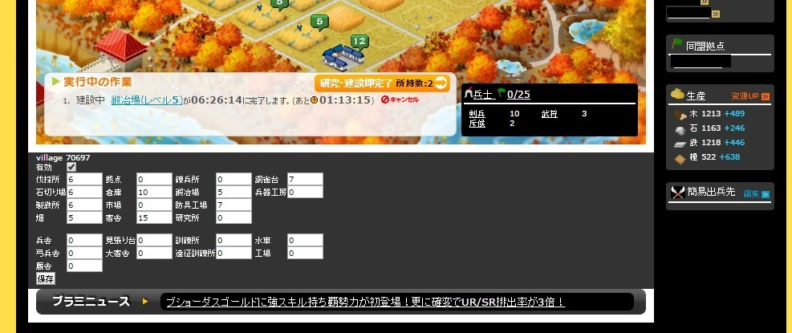
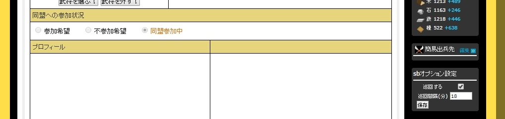

# ブラ三 機能を絞った自動施設建設 Tampermonkey用

### 3gokushi-simplebuild (simplebuild)とは

ブラウザ三国志で自動建設ツールというとGreasemonkeyで動くAutoBilderが超有名ですが、
ChromeのTampermonkeyでも自動建設したかったので、必要最低限の機能を備えた自動建設ツールを作成しました。

### simplebuildの特徴

- レベルアップしたい施設のレベル値を設定しておけば、資源が許す限り自動で建設します。
- 自動巡回付き。
- 自動巡回時間は3分おきに最長24分まで設定可能。

### 動作確認バージョン

2014年10月21日現在、以下のバージョンで動作を確認しています。

- Tampermonkey: v3.9
- Google Chrome: バージョン37.0.2062.124m
- ブラウザ三国志:（たぶんどのサーバーでも大丈夫なはずです..）
    - 公式サーバー(s28)
    - Yahoo!モバゲー(y26)

### インストール

必要なファイルは3gokushi-simplebuild.jsだけです。
具体的なインストールのやり方はTampermonkeyを参照してください。

### simplebuildの使い方

次の2種類の画面で使います。

#### 本拠地・村・砦画面

マップ画面の下に、入力コンテナが表示されます。「保存」ボタンを押すと入力した数値が保存されます。

#### プロフィール

サイドバーの右下に、sbオプションというコンテナが表示されます。「保存」ボタンを押すと保存されます。

#### その他

何かありましたらこのgithubに、作者kitemwまでお気軽にどうぞ。

#### TODO

- ユニットテストの実装。どのようにテストするかも含めて。

